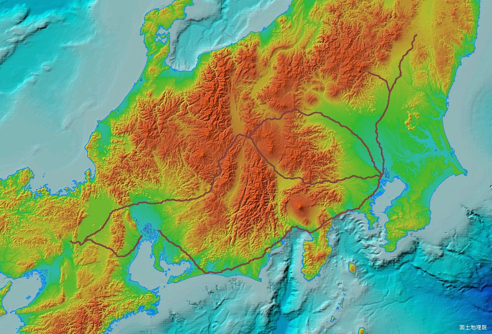
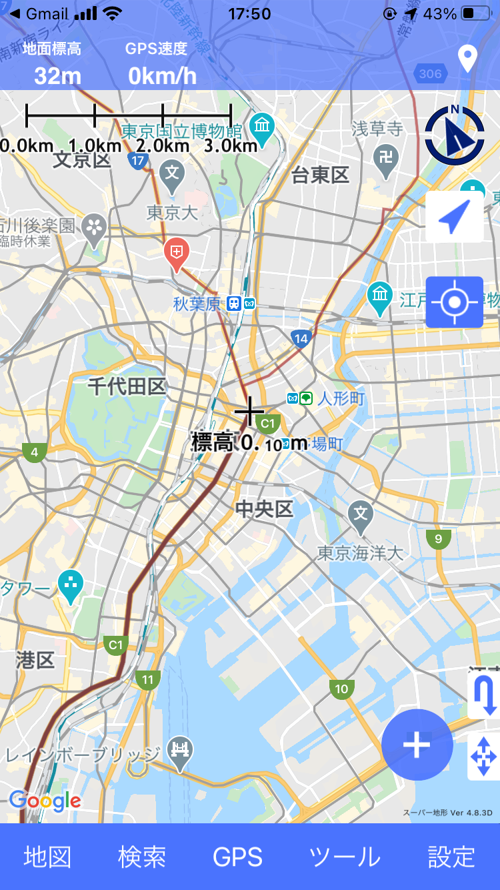

　
# 五街道GPX および五街道KML：　GISに表示可能な五街道の数値データ・データセット

## 概　 要    
地理情報システム（GIS：Geographic Information System）で表示や再利用ができる五街道（東海道，中山道，日光街道，奥州街道，甲州街道）の数値データは，2020年現在，インターネット上で検索する限りは見当たりません．  

本データセットは五街道のラインデータをGIS分野で汎用的な２種類のフォーマットで提供するものです．GISソフトやアプリへドラッグ・アンド・ドロップもしくはインポートしますとトラックファイル（ラインデータ）が線として表示することができます．

## 五街道のデータ
なお五街道は部分的に重複もありますので，各街道線は，以下の単独区間を対象としています．
* **東海道**（日本橋ー三条大橋；　ただし宮ー桑名間は海路のためkmlファイルは海路を挟んで二分割）
* **中山道**（日本橋ー草津追分）
* **日光街道**（日本橋ー日光神橋）
* **奥州街道**（宇都宮ー白河追分；　日本橋ー宇都宮は日光街道）
* **甲州街道**（日本橋ー下諏訪追分）

Figure. gpxデータをカシミール3Dで出力・可視化した図  

## データセット概要     
+ **データ形式**：　GPX（GPS eXchange Format），KML（Keyhole Markup Language）  
+ **測地系**：　世界測地系
+ **種別**:　ライン（線データ）
+ **データ構成**：　「data」フォルダの配下にある「gpx」および「kml」に，それぞれのデータフォーマットの五街道のデータが格納されています．
  + 「gpx」：　五街道の起点・終点間のトラックポイント（緯度，経度，標高）をつないだ点群
  + 「kml」：　五街道の起点・終点間のポイント（緯度，経度，標高）をつないだ点群
    
## 利用方法

1. ダウンロードは画面右上の「code」のボタンを押すとzip形式で本リポジトリ内のドキュメントが全てダウンロードされます．
1. zipを解凍すると「data」フォルダ内のGPX，KMLファイルを取得できます．
1. GPX，KML対応のGISソフト（Google Earth, カシミール3Dなど）にドラッグ＆ドロップすると自動的に表示がなされます．

## 利用事例

『五街道のトラックデータ（gpx，kml）を『スーパー地形』へ転送してナビ設定』
https://note.com/smatsu/n/n4cf861420729

## 引用・参考サイト  

1. 谷謙二: 時系列地形図閲覧サイト「今昔マップ on the web」  
 http://ktgis.net/kjmapw/index.html  

1. スタンフォード大学: Gaihōzu Japanese Imperial Maps  
  https://stanford.maps.arcgis.com/apps/SimpleViewer/index.html?appid=733446cc5a314ddf85c59ecc10321b41

1. 宮崎県情報政策課：「ひなたGIS」＞　日本版MapWarper 5万分の1  
  https://hgis.pref.miyazaki.lg.jp/hinata/
  
## ライセンス（著作権について）
* このデータセットはクリエイティブ・コモンズの[**CC BY-NC-SA 4.0**（表示 - 非営利 - 継承 4.0 国際）](https://creativecommons.org/licenses/by-nc-sa/4.0/deed.ja)の下に提供されています．

　　　　　

* CC BY-NC-SA 4.0条件であれば連絡は不要ですが，出版などの商用・営利目的で利用されたい場合には連絡をお願いいたします．  

## コンタクト先
比定の誤りが認められる場合，商用・営利目的での利用は「コンタクト先」でご連絡をいただければ幸いです．  
japan.road.jp@gmail.com （国道愛好家　松波宛）
  
## 履歴  
2021.01.11　公開  
